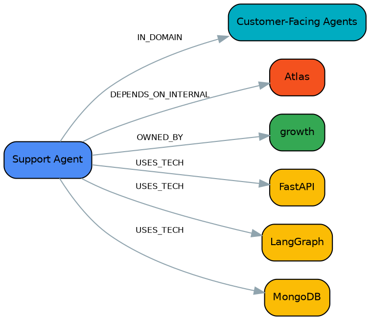

**English** · [中文](README.md)

# acme-corp — commands and their output

`acme-corp` is a fictional company: 25 repos, 10 teams, every value invented (see the comment at
the top of `data/seed.yaml`). It runs exactly the same pipeline as the real validation described in
the main [README](../../README.en.md#status-it-runs-on-real-data). This document walks the pipeline
from start to finish and pastes the real terminal output of each step, so you can see what the tool
does without installing anything.

Look at the graph online (no commands to run):
**<https://xukanz.github.io/epistemic-agent/index.en.html>** — that is the output of the
`capmap export --format html --lang en` step near the end of this document.
([Chinese interface](https://xukanz.github.io/epistemic-agent/).)

Run it yourself:

```bash
cd instances/acme-corp
python scripts/bootstrap.py --out payload.bootstrap.json
capmap ingest payload.bootstrap.json
capmap merge
capmap health
```

> **A note on the pasted output.** The CLI's own chrome — table headers, prompts — is currently
> Chinese only; `--lang` localises the exported HTML page, not the terminal. The output blocks below
> are pasted verbatim rather than translated, because they are the real thing. The recurring column
> headers translate as:
>
> | Chinese | English | | Chinese | English |
> |---|---|---|---|---|
> | 分片 | shard | | 术语 | term |
> | 技术数 | technologies | | 状态 | status |
> | 仓库 / 仓库数 | repos / repo count | | 能力/技术 | capability / technology |
> | 团队 / 涉及团队 | teams / teams involved | | 唯一团队 | sole team |
> | 最常用 | most used | | 内部系统 | internal system |
> | 关系 | relation / relationships | | 依赖仓库 | dependent repos |
> | 领域 | domain | | 方向 · ← 入 | direction · inbound |
> | 重合度 | overlap | | 边类型 / 数量 | edge type / count |
> | 共同技术 | shared technologies | | 邻居类型 / 示例 | neighbour type / examples |
> | 类型 · 度数 | type · degree | | 接地置信度 | grounding confidence |
> | 按团队分布 | breakdown by team | | 更新于 · 来源 | updated · sources |
> | 名称 · 说明 | name · description | | 节点 · 边 | nodes · edges |

---

## 1. `python scripts/bootstrap.py --out payload.bootstrap.json`

Deterministic cold start: turns `data/seed.yaml` into the node/edge shape `capmap ingest`
understands. No LLM call involved.

```text
{
  "repos": 25,
  "nodes_by_type": {
    "Domain": 6,
    "InternalSystem": 3,
    "Repo": 25,
    "Team": 10,
    "TechStack": 27
  },
  "edges_by_type": {
    "DEPENDS_ON_INTERNAL": 25,
    "IN_DOMAIN": 25,
    "OWNED_BY": 25,
    "USES_TECH": 74
  }
}

Payload written to /home/.../instances/acme-corp/payload.bootstrap.json
  71 nodes, 149 edges
```

## 2. `capmap ingest payload.bootstrap.json`

The only write path: takes the node labels in the payload, matches them against the vocabulary
(grounding), routes them by one of three confidence bands, writes the graph, writes the changelog,
and updates the idempotency manifest.

```text
1/1 source files changed
Grounding: 29 grounded, 1 candidates, 0 ungrounded, 41 structural
Ingest: +71 nodes, ~0 updated, +149 edges
```

The `1 candidates` is `dbt` — the vocabulary has no such term, fuzzy matching tops out at 0.50, so
it lands in the "needs a human" band rather than being forced onto something else. That entry shows
up in `review/items.jsonl`; see §14, `capmap review-status`.

## 3. `capmap merge`

Applies the strategies configured in `config/project.yaml` (alias / fuzzy_label / natural_key /
multi_token) to collapse aliases and find duplicates, iterating to a fixed point.

```text
Merges applied: 0 over 0 round(s)
Nodes: 71 → 71
Edges: 149 → 149
dropped 0 duplicate edges, 0 self-loops; 0 properties set from the vocabulary
Report: kg/merge-report.md
```

This sample data is clean synthetic data with no alias conflicts, hence 0 merges — that is the
expected result, not the pipeline failing to fire. On real data this step usually folds things like
`k8s` / `Kubernetes` / `K8S` into a single node.

## 4. `capmap health`

Produces quality signals plus capability-map signals, and writes `kg/health-manifest.json`.

```text
KG Health Manifest — 2026-08-07T11:31:46
 Total nodes  71
 Total edges  149
Nodes by type
 type            count
 Domain              6
 InternalSystem      3
 Repo               25
 Team               10
 TechStack          27
Quality signals
 signal                            count
 Ungrounded semantic nodes             1
 Grounding candidates (0.50–0.70)      1
 Fuzzy duplicate pairs                 0
 Schema gap clusters                   0
 Orphan nodes                          0
 Stale nodes                           1
 Deprecated nodes                      0
Capability-map signals
 signal                                   count
 Bus factor = 1 (single-team capability)     18
 Duplicate-effort candidates                  3
 Uncovered vocabulary terms                 193
 Internal systems with dependents             3

Manifest written to kg/health-manifest.json
```

`Stale nodes = 1` is `api-gateway/legacy-router`; its `last_commit` is deliberately set to
2025-02-11 in the seed data — over a year without a commit, to demonstrate the signal.

## 5. `capmap stats`

A lighter instant snapshot than `health`: writes no files, terminal output only.

```text
acme-corp — 71 nodes, 149 edges
 node type       count
 Domain              6
 InternalSystem      3
 Repo               25
 Team               10
 TechStack          27
 edge type            count
 DEPENDS_ON_INTERNAL     25
 IN_DOMAIN               25
 OWNED_BY                25
 USES_TECH               74
Connectivity: 71 connected, 0 isolated
```

## 6. `capmap view coverage`

One of the five deterministic analysis views: the tech-stack distribution by vocabulary shard — how
many technologies exist in each direction, and how many repos and teams they cover. (Table title:
"Tech-stack coverage, by vocabulary shard".)

```text
技术栈覆盖（按词表分片）
┏━━━━━━━━━━━━━━━━━━━━━━┳━━━━━━━━┳━━━━━━┳━━━━━━┳━━━━━━━━━━━━━━━━━━━━━━━━━━━━━━━━┓
┃ 分片                 ┃ 技术数 ┃ 仓库 ┃ 团队 ┃ 最常用                         ┃
┡━━━━━━━━━━━━━━━━━━━━━━╇━━━━━━━━╇━━━━━━╇━━━━━━╇━━━━━━━━━━━━━━━━━━━━━━━━━━━━━━━━┩
│ web-service          │ 3      │ 17   │ 10   │ FastAPI(15), Flask(1),         │
│                      │        │      │      │ Streamlit(1)                   │
│ storage-retrieval    │ 7      │ 15   │ 7    │ PostgreSQL(7), Redis(4),       │
│                      │        │      │      │ MongoDB(3), Elasticsearch(2),  │
│                      │        │      │      │ ChromaDB(1)                    │
│ agent-framework      │ 1      │ 13   │ 8    │ LangGraph(13)                  │
│ observability-eval   │ 5      │ 5    │ 3    │ MLflow(3), Langfuse(2),        │
│                      │        │      │      │ pytest(2), Grafana 栈(1),      │
│                      │        │      │      │ OpenTelemetry(1)               │
│ llm-provider         │ 3      │ 4    │ 4    │ Anthropic Claude(2),           │
│                      │        │      │      │ Portkey(2), OpenAI(1)          │
│ infra-deploy         │ 3      │ 3    │ 2    │ Docker(2), GitHub Actions(1),  │
│                      │        │      │      │ Kubernetes(1)                  │
│ (ungrounded)         │ 1      │ 2    │ 1    │ dbt(2)                         │
│ dev-agent-tooling    │ 2      │ 2    │ 2    │ Typer(2), uv(1)                │
│ document-data        │ 1      │ 1    │ 1    │ 任务调度(1)                    │
│ protocol-integration │ 1      │ 1    │ 1    │ OAuth2 / OIDC(1)               │
└──────────────────────┴────────┴──────┴──────┴────────────────────────────────┘
```

The `(ungrounded)` row is `dbt`, which never made it into the vocabulary. The coverage view does not
pretend it doesn't exist; it reports it honestly on its own row. (`任务调度` is a Chinese-labelled
vocabulary term meaning "task scheduling" — the seed data includes it to show that node labels are
not required to be English.)

## 7. `capmap view duplicates`

Pairs of repos that are cross-team, in the same domain, and share most of a tech stack — this
sample data has three signals planted in it deliberately. (Table title: "Suspected duplicate effort
— cross-team, same domain, heavy stack overlap".)

```text
疑似重复投入（跨团队、同领域、栈高度重合）
┏━━━━━━━━━━━┳━━━━━━━━━━━┳━━━━━━━━━━┳━━━━━━━━━━━┳━━━━━━━━━━┳━━━━━━━━┳━━━━━━━━━━━┓
┃ 关系      ┃ 领域      ┃ A        ┃ B         ┃ 团队     ┃ 重合度 ┃ 共同技术  ┃
┡━━━━━━━━━━━╇━━━━━━━━━━━╇━━━━━━━━━━╇━━━━━━━━━━━╇━━━━━━━━━━╇━━━━━━━━╇━━━━━━━━━━━┩
│ independe │ Customer- │ Invoice  │ Onboardin │ billing  │ 1.00   │ FastAPI,  │
│ nt        │ Facing    │ Agent    │ g Agent   │ / growth │        │ LangGraph │
│           │ Agents    │          │           │          │        │ ,         │
│           │           │          │           │          │        │ PostgreSQ │
│           │           │          │           │          │        │ L         │
│ independe │ Platform  │ Model    │ Agent     │ growth / │ 0.80   │ FastAPI,  │
│ nt        │ / Gateway │ Router   │ Gateway   │ platform │        │ LangGraph │
│           │ /         │          │           │          │        │ ,         │
│           │ Framework │          │           │          │        │ Portkey,  │
│           │           │          │           │          │        │ Redis     │
│ fork-or-c │ Customer- │ Support  │ Support   │ growth / │ 1.00   │ FastAPI,  │
│ opy       │ Facing    │ Agent    │ Agent     │ mobile   │        │ LangGraph │
│           │ Agents    │          │           │          │        │ , MongoDB │
└───────────┴───────────┴──────────┴───────────┴──────────┴────────┴───────────┘
重合 ≠ 重复。independent 才值得看；1/3 行是同名或
fork/副本，已排到后面。任何一行都要人工判断后才写 DUPLICATES 边。
```

The footer reads: *overlap ≠ duplication. Only `independent` is worth a look; 1 of 3 rows is a
same-name fork/copy and has been sorted to the bottom. Every row needs a human decision before a
`DUPLICATES` edge is written.*

The three rows demonstrate the three cases this view has to distinguish. `growth/model-router` and
`platform/agent-gateway` are two teams that genuinely each built a gateway (`independent`, worth
confirming with a person); `growth/support-agent` and `mobile/support-agent` share a name and are
classified `fork-or-copy`, which ranks lower.

## 8. `capmap view gaps`

Capabilities that are in the vocabulary but absent from the graph (or present in only one repo).
Note that this is *not* the same as "nobody has them" — see the two notices at the end of the
output. (Table title: "Capability gaps — no-repo = in the vocabulary but nobody does it;
single-repo = exactly 1 repo".)

```text
能力缺口（no-repo = 词表里有但没人做；single-repo = 只有 1
个仓库）
┏━━━━━━━━━━━━━━━━━┳━━━━━━━━━━━━━━━━━━━━┳━━━━━━━━━┳━━━━━━━━┓
┃ 分片            ┃ 术语               ┃ 状态    ┃ 仓库数 ┃
┡━━━━━━━━━━━━━━━━━╇━━━━━━━━━━━━━━━━━━━━╇━━━━━━━━━╇━━━━━━━━┩
│ agent-framework │ AWS Strands Agents │ no-repo │ 0      │
│ agent-framework │ Agno               │ no-repo │ 0      │
│ agent-framework │ AutoGen            │ no-repo │ 0      │
│ agent-framework │ Claude Agent SDK   │ no-repo │ 0      │
│ agent-framework │ CopilotKit         │ no-repo │ 0      │
│ agent-framework │ CrewAI             │ no-repo │ 0      │
│ agent-framework │ DSPy               │ no-repo │ 0      │
│ agent-framework │ DeepAgents         │ no-repo │ 0      │
└─────────────────┴────────────────────┴─────────┴────────┘
… 178 more rows (use --limit 0 for all)
另有 0 个未接地的一次性标签未列入——那是词表建议，见
vocabulary-suggestions.md，不是能力缺口。
no-repo 只在词表完整且摄取完整时才等于「没人做」，两者都从来不完全成立。
注意 图里没有任何 Pattern 节点，词表中 20 个 Pattern
术语已整体排除出本视图——这说明抽取 Pattern
的那一步还没跑，不能读作「这些能力没人具备」。
```

The three notices read: *0 further ungrounded one-off labels are not listed — those are vocabulary
suggestions, see `vocabulary-suggestions.md`, not capability gaps.* / *`no-repo` only means "nobody
does it" when both the vocabulary and the ingestion are complete, and neither ever fully is.* /
*Note: the graph contains no `Pattern` nodes at all, so all 20 `Pattern` terms in the vocabulary
have been excluded from this view wholesale — that means the Pattern-extraction step has not been
run, and must not be read as "nobody has these capabilities".*

acme-corp only covers a small slice of the 219 terms in the generic vocabulary (it only has 25
repos, after all), so most rows are `no-repo`. That is a natural consequence of the example being
small, not evidence of a badly designed vocabulary.

## 9. `capmap view experts -q "langgraph"`

Give it a technology or capability name and it lists every repo that has used it, sorted by most
recent commit — "who do I talk to if I want to do this" is a single query here. (Table title:
"langgraph experts, by most recent commit".)

```text
langgraph 专家（按最近提交排序）
… 13 行，节选：
platform/agent-gateway   platform    2026-06-02  Central place every other team's...
sre/incident-copilot     sre         2026-06-25  Cuts the time to first meaningful...
growth/model-router      growth      2026-05-20  Adds per-experiment routing rules...
security/access-review-bot  security 2026-05-14  Turns a manual quarterly audit...
growth/support-agent     growth      2026-03-02  Same assistant as mobile's...
```

(`… 13 行，节选：` = "… 13 rows, excerpted:")

## 10. `capmap view risk`

Two tables: which technologies only one team knows (bus factor = 1), and which internal systems
everybody depends on (internal lock-in). (Table titles: "Single-team capabilities (bus factor = 1)"
and "Internal-system dependency concentration".)

```text
单团队掌握的能力（bus factor = 1）
┏━━━━━━━━━━━━━━━━┳━━━━━━━━━━━━━┳━━━━━━━━┓
┃ 能力/技术      ┃ 唯一团队    ┃ 仓库数 ┃
┡━━━━━━━━━━━━━━━━╇━━━━━━━━━━━━━╇━━━━━━━━┩
│ dbt            │ data-eng    │ 2      │
│ Docker         │ api-gateway │ 2      │
│ Elasticsearch  │ search      │ 2      │
│ Langfuse       │ ml-research │ 2      │
│ pytest         │ ml-research │ 2      │
│ 任务调度       │ billing     │ 1      │
│ ChromaDB       │ platform    │ 1      │
│ Flask          │ api-gateway │ 1      │
│ GitHub Actions │ security    │ 1      │
│ Grafana 栈     │ sre         │ 1      │
│ Kubernetes     │ api-gateway │ 1      │
│ OAuth2 / OIDC  │ security    │ 1      │
│ OpenAI         │ ml-research │ 1      │
│ OpenTelemetry  │ sre         │ 1      │
│ Qdrant         │ growth      │ 1      │
│ Snowflake      │ data-eng    │ 1      │
│ Streamlit      │ ml-research │ 1      │
│ uv             │ platform    │ 1      │
└────────────────┴─────────────┴────────┘
内部系统依赖集中度
┏━━━━━━━━━━┳━━━━━━━━━━┳━━━━━━━━━━┓
┃ 内部系统 ┃ 依赖仓库 ┃ 涉及团队 ┃
┡━━━━━━━━━━╇━━━━━━━━━━╇━━━━━━━━━━┩
│ Atlas    │ 16       │ 8        │
│ Forge    │ 5        │ 4        │
│ Beacon   │ 4        │ 3        │
└──────────┴──────────┴──────────┘
```

`Atlas` (a fictional internal service gateway) is depended on by 16 of 25 repos and 8 of 10 teams —
this is the internal lock-in signal deliberately designed into the seed data: if Atlas breaks or
gets decommissioned, the blast radius is larger than that of any single technology choice.

## 11. `capmap show atlas`

Single-node drill-down: properties, relationships, and breakdown by team — three sections that
together answer "what is this thing, who uses it, and how concentrated is that use".

```text
（词表 → is:atlas（Atlas））

Atlas  sys-atlas
类型 InternalSystem · 度数 16
 label        Atlas
 kind         platform
 term_id      is:atlas
 ontology_id  internal-system
 raw_label    Atlas
关系
┏━━━━━━┳━━━━━━━━━━━━━━━━━━━━━┳━━━━━━┳━━━━━━━━━━┳━━━━━━━━━━━━━━━━━━━━━━━━━━━━━━━┓
┃ 方向 ┃ 边类型              ┃ 数量 ┃ 邻居类型 ┃ 示例                          ┃
┡━━━━━━╇━━━━━━━━━━━━━━━━━━━━━╇━━━━━━╇━━━━━━━━━━╇━━━━━━━━━━━━━━━━━━━━━━━━━━━━━━━┩
│ ← 入 │ DEPENDS_ON_INTERNAL │ 16   │ Repo×16  │ Agent Gateway, Dunning        │
│      │                     │      │          │ Service, ETL Orchestrator,    │
│      │                     │      │          │ Edge Router, Experiment       │
│      │                     │      │          │ Service, Feature Store,       │
│      │                     │      │          │ Incident Copilot, Invoice     │
│      │                     │      │          │ Agent, Model Router,          │
│      │                     │      │          │ Onboarding Agent, Query       │
│      │                     │      │          │ Planner, Relevance Agent … 另 │
│      │                     │      │          │ 4 个                          │
└──────┴─────────────────────┴──────┴──────────┴───────────────────────────────┘
按团队分布
┏━━━━━━━━━━━━━┳━━━━━━━━┓
┃ 团队        ┃ 仓库数 ┃
┡━━━━━━━━━━━━━╇━━━━━━━━┩
│ growth      │      4 │
│ data-eng    │      3 │
│ billing     │      2 │
│ search      │      2 │
│ sre         │      2 │
│ api-gateway │      1 │
│ mobile      │      1 │
│ platform    │      1 │
└─────────────┴────────┘
接地置信度 1.0 · 更新于 2026-08-07
来源 1 处（--json 看完整路径）
```

The header line means "vocabulary → is:atlas (Atlas)" — how the name `atlas` was resolved. The
footer means "grounding confidence 1.0 · updated 2026-08-07 / 1 source (use `--json` for the full
paths)". `… 另 4 个` in the examples column is "… 4 more".

Running the same command on a `Repo` node (`capmap show platform/agent-gateway`, say) produces no
"breakdown by team" table — that table answers "which teams use this technology/system", and a repo
belongs to exactly one team, so there is no distribution to show.

## 12. `capmap export --format html --lang en`

Produces the site linked at the top of this document: a self-contained force-directed graph viewer
with 4 switchable built-in views, making no network requests. Drop `--lang en` and you get the same
graph with a Chinese interface (which is what `docs/index.html` is).

```text
内置视图
 key     名称                节点  边   说明
 tech    Tech co-occurrence  5     6    Two technologies are linked when ≥3 repos use both
 team    Team ↔ tech         37    54   Who uses what
 domain  Domain ↔ tech       17    17   Which parts of the business use which stack (≥2 repos to
                                        draw an edge)
 full    Everything          71    149  Every node and edge. Shows structural density, not detail
已写入 kg/capability-map.html  (52 KB)
Open directly in a browser (double-click, or xdg-open/open) — no network needed.
```

(`内置视图` = "built-in views"; `已写入` = "wrote".)

## 13. `capmap export --format dot --around growth/support-agent --hops 1`

Exports a neighbourhood subgraph rather than the whole graph. The DOT writer refuses outright above
300 nodes, and `--around` / `--hops` are how you trim the graph down to something legible.

```text
中心节点 1 个（exact path），扩展 1 跳
邻域子图 7 节点 / 6 边
已写入 around.dot  (1 KB)
`dot -Tsvg 该文件 -o out.svg`（或 `neato` / `fdp` 布局更适合网状图）。
```

That reads: *1 centre node (exact path), expanded 1 hop / neighbourhood subgraph: 7 nodes / 6 edges
/ wrote `around.dot` (1 KB) / `dot -Tsvg <file> -o out.svg` (or the `neato` / `fdp` layouts, which
suit mesh-like graphs better).*

The resulting `.dot` file (feed it straight to Graphviz):



## 14. `capmap review-status`

An overview of the review queue — it does not enter the queue, it just shows what is pending.

```text
acme-corp — 1 pending review items
 source_type           count
 vocabulary_grounding      1
  0.50 Ground 'dbt'?
```

That is the `dbt` grounding candidate from the ingest in step 2. Actually resolving it means running
`capmap review`, which opens an interactive terminal UI (TUI) — one accept/reject at a time, not
something worth screenshotting here; you only need it when the queue is non-empty.

---

See it live: **<https://xukanz.github.io/epistemic-agent/index.en.html>**
