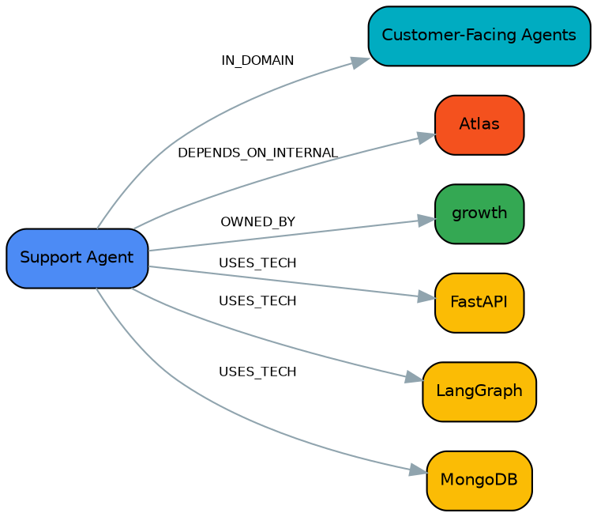

# acme-corp — 命令与输出速查

`acme-corp` 是一家虚构公司：25 个仓库、10 个团队，数据全部编造（见
`data/seed.yaml` 开头的注释），跑的是和主 [README](../../README.md#现状跑得通有真实产出)
里描述的真实验证完全相同的一套流水线。这份文档把流水线从头到尾跑一遍，
每一步贴出真实的终端输出，不用自己装环境也能看懂这套工具做了什么。

在线看图谱（不用跑任何命令）：**<https://xukanz.github.io/epistemic-agent/>**——
这就是本文档最后 `capmap export --format html` 那一步的产物。

自己跑一遍：

```bash
cd instances/acme-corp
python scripts/bootstrap.py --out payload.bootstrap.json
capmap ingest payload.bootstrap.json
capmap merge
capmap health
```

---

## 1. `python scripts/bootstrap.py --out payload.bootstrap.json`

确定性冷启动：把 `data/seed.yaml` 转成 `capmap ingest` 认识的节点/边格式，
不涉及任何 LLM 调用。

```text
{
  "repos": 25,
  "nodes_by_type": {
    "Domain": 6,
    "InternalSystem": 3,
    "Repo": 25,
    "Team": 10,
    "TechStack": 27
  },
  "edges_by_type": {
    "DEPENDS_ON_INTERNAL": 25,
    "IN_DOMAIN": 25,
    "OWNED_BY": 25,
    "USES_TECH": 74
  }
}

Payload written to /home/.../instances/acme-corp/payload.bootstrap.json
  71 nodes, 149 edges
```

## 2. `capmap ingest payload.bootstrap.json`

唯一写入口：把 payload 里的节点标签拿去和词表比对（接地），按三档置信度
路由，写图谱、写 changelog、更新幂等 manifest。

```text
1/1 source files changed
Grounding: 29 grounded, 1 candidates, 0 ungrounded, 41 structural
Ingest: +71 nodes, ~0 updated, +149 edges
```

`1 candidates` 是 `dbt`——词表里没有这个术语，模糊匹配最高只有 0.50 分，
落进"待人工审查"那一档，没有被强行接地成别的东西。这条会出现在
`review/items.jsonl` 里，见第 9 节 `capmap review-status`。

## 3. `capmap merge`

按 `config/project.yaml` 里配置的策略（alias / fuzzy_label / natural_key /
multi_token）折叠别名、查重复，迭代到不动点为止。

```text
Merges applied: 0 over 0 round(s)
Nodes: 71 → 71
Edges: 149 → 149
dropped 0 duplicate edges, 0 self-loops; 0 properties set from the vocabulary
Report: kg/merge-report.md
```

这份示例数据本来就是干净的合成数据，没有别名冲突，所以 0 次合并——这是
预期结果，不是流水线没起作用。真实场景里这一步通常会把 `k8s`/`Kubernetes`/
`K8S` 这类同名异写折叠成一个节点。

## 4. `capmap health`

生成质量信号 + 能力地图信号，写 `kg/health-manifest.json`。

```text
KG Health Manifest — 2026-08-07T11:31:46
 Total nodes  71
 Total edges  149
Nodes by type
 type            count
 Domain              6
 InternalSystem      3
 Repo               25
 Team               10
 TechStack          27
Quality signals
 signal                            count
 Ungrounded semantic nodes             1
 Grounding candidates (0.50–0.70)      1
 Fuzzy duplicate pairs                 0
 Schema gap clusters                   0
 Orphan nodes                          0
 Stale nodes                           1
 Deprecated nodes                      0
Capability-map signals
 signal                                   count
 Bus factor = 1 (single-team capability)     18
 Duplicate-effort candidates                  3
 Uncovered vocabulary terms                 193
 Internal systems with dependents             3

Manifest written to kg/health-manifest.json
```

`Stale nodes = 1` 是 `api-gateway/legacy-router`，`last_commit` 在种子数据里
故意写成 2025-02-11——一年多没提交，用来演示这个信号。

## 5. `capmap stats`

比 `health` 更轻量的即时快照，不写文件，纯终端输出。

```text
acme-corp — 71 nodes, 149 edges
 node type       count
 Domain              6
 InternalSystem      3
 Repo               25
 Team               10
 TechStack          27
 edge type            count
 DEPENDS_ON_INTERNAL     25
 IN_DOMAIN               25
 OWNED_BY                25
 USES_TECH               74
Connectivity: 71 connected, 0 isolated
```

## 6. `capmap view coverage`

五个确定性分析视图之一：按词表分片看技术栈分布——哪个方向有多少种技术、
覆盖了多少仓库和团队。

```text
技术栈覆盖（按词表分片）
┏━━━━━━━━━━━━━━━━━━━━━━┳━━━━━━━━┳━━━━━━┳━━━━━━┳━━━━━━━━━━━━━━━━━━━━━━━━━━━━━━━━┓
┃ 分片                 ┃ 技术数 ┃ 仓库 ┃ 团队 ┃ 最常用                         ┃
┡━━━━━━━━━━━━━━━━━━━━━━╇━━━━━━━━╇━━━━━━╇━━━━━━╇━━━━━━━━━━━━━━━━━━━━━━━━━━━━━━━━┩
│ web-service          │ 3      │ 17   │ 10   │ FastAPI(15), Flask(1),         │
│                      │        │      │      │ Streamlit(1)                   │
│ storage-retrieval    │ 7      │ 15   │ 7    │ PostgreSQL(7), Redis(4),       │
│                      │        │      │      │ MongoDB(3), Elasticsearch(2),  │
│                      │        │      │      │ ChromaDB(1)                    │
│ agent-framework      │ 1      │ 13   │ 8    │ LangGraph(13)                  │
│ observability-eval   │ 5      │ 5    │ 3    │ MLflow(3), Langfuse(2),        │
│                      │        │      │      │ pytest(2), Grafana 栈(1),      │
│                      │        │      │      │ OpenTelemetry(1)               │
│ llm-provider         │ 3      │ 4    │ 4    │ Anthropic Claude(2),           │
│                      │        │      │      │ Portkey(2), OpenAI(1)          │
│ infra-deploy         │ 3      │ 3    │ 2    │ Docker(2), GitHub Actions(1),  │
│                      │        │      │      │ Kubernetes(1)                  │
│ (ungrounded)         │ 1      │ 2    │ 1    │ dbt(2)                         │
│ dev-agent-tooling    │ 2      │ 2    │ 2    │ Typer(2), uv(1)                │
│ document-data        │ 1      │ 1    │ 1    │ 任务调度(1)                    │
│ protocol-integration │ 1      │ 1    │ 1    │ OAuth2 / OIDC(1)               │
└──────────────────────┴────────┴──────┴──────┴────────────────────────────────┘
```

`(ungrounded)` 那一行就是没进词表的 `dbt`——覆盖视图不会假装它不存在，
而是单独一行如实标出来。

## 7. `capmap view duplicates`

跨团队、同领域、技术栈高度重合的仓库对——这份示例数据里特意埋了三个信号。

```text
疑似重复投入（跨团队、同领域、栈高度重合）
┏━━━━━━━━━━━┳━━━━━━━━━━━┳━━━━━━━━━━┳━━━━━━━━━━━┳━━━━━━━━━━┳━━━━━━━━┳━━━━━━━━━━━┓
┃ 关系      ┃ 领域      ┃ A        ┃ B         ┃ 团队     ┃ 重合度 ┃ 共同技术  ┃
┡━━━━━━━━━━━╇━━━━━━━━━━━╇━━━━━━━━━━╇━━━━━━━━━━━╇━━━━━━━━━━╇━━━━━━━━╇━━━━━━━━━━━┩
│ independe │ Customer- │ Invoice  │ Onboardin │ billing  │ 1.00   │ FastAPI,  │
│ nt        │ Facing    │ Agent    │ g Agent   │ / growth │        │ LangGraph │
│           │ Agents    │          │           │          │        │ ,         │
│           │           │          │           │          │        │ PostgreSQ │
│           │           │          │           │          │        │ L         │
│ independe │ Platform  │ Model    │ Agent     │ growth / │ 0.80   │ FastAPI,  │
│ nt        │ / Gateway │ Router   │ Gateway   │ platform │        │ LangGraph │
│           │ /         │          │           │          │        │ ,         │
│           │ Framework │          │           │          │        │ Portkey,  │
│           │           │          │           │          │        │ Redis     │
│ fork-or-c │ Customer- │ Support  │ Support   │ growth / │ 1.00   │ FastAPI,  │
│ opy       │ Facing    │ Agent    │ Agent     │ mobile   │        │ LangGraph │
│           │ Agents    │          │           │          │        │ , MongoDB │
└───────────┴───────────┴──────────┴───────────┴──────────┴────────┴───────────┘
重合 ≠ 重复。independent 才值得看；1/3 行是同名或
fork/副本，已排到后面。任何一行都要人工判断后才写 DUPLICATES 边。
```

三行分别演示了这个视图要区分的三种情况：`growth/model-router` 和
`platform/agent-gateway` 是两个团队真的各自造了一个网关（`independent`，
值得人工确认）；`growth/support-agent` 和 `mobile/support-agent` 同名，
判成 `fork-or-copy`，优先级更低。

## 8. `capmap view gaps`

词表里有、图里没有（或只有一个仓库）的能力——注意这不等于"没人具备"，
见输出末尾的两条提示。

```text
能力缺口（no-repo = 词表里有但没人做；single-repo = 只有 1
个仓库）
┏━━━━━━━━━━━━━━━━━┳━━━━━━━━━━━━━━━━━━━━┳━━━━━━━━━┳━━━━━━━━┓
┃ 分片            ┃ 术语               ┃ 状态    ┃ 仓库数 ┃
┡━━━━━━━━━━━━━━━━━╇━━━━━━━━━━━━━━━━━━━━╇━━━━━━━━━╇━━━━━━━━┩
│ agent-framework │ AWS Strands Agents │ no-repo │ 0      │
│ agent-framework │ Agno               │ no-repo │ 0      │
│ agent-framework │ AutoGen            │ no-repo │ 0      │
│ agent-framework │ Claude Agent SDK   │ no-repo │ 0      │
│ agent-framework │ CopilotKit         │ no-repo │ 0      │
│ agent-framework │ CrewAI             │ no-repo │ 0      │
│ agent-framework │ DSPy               │ no-repo │ 0      │
│ agent-framework │ DeepAgents         │ no-repo │ 0      │
└─────────────────┴────────────────────┴─────────┴────────┘
… 178 more rows (use --limit 0 for all)
另有 0 个未接地的一次性标签未列入——那是词表建议，见
vocabulary-suggestions.md，不是能力缺口。
no-repo 只在词表完整且摄取完整时才等于「没人做」，两者都从来不完全成立。
注意 图里没有任何 Pattern 节点，词表中 20 个 Pattern
术语已整体排除出本视图——这说明抽取 Pattern
的那一步还没跑，不能读作「这些能力没人具备」。
```

acme-corp 只覆盖了通用词表 219 个术语里的一小部分（毕竟只有 25 个仓库），
所以大部分行都是 `no-repo`——这是示例规模小的自然结果，不代表词表设计得
不好。

## 9. `capmap view experts -q "langgraph"`

给一个技术/能力名，列出所有用过它的仓库，按最近提交排序——"要做这件事该
找谁"这个问题在这里就是一次查询。

```text
langgraph 专家（按最近提交排序）
… 13 行，节选：
platform/agent-gateway   platform    2026-06-02  Central place every other team's...
sre/incident-copilot     sre         2026-06-25  Cuts the time to first meaningful...
growth/model-router      growth      2026-05-20  Adds per-experiment routing rules...
security/access-review-bot  security 2026-05-14  Turns a manual quarterly audit...
growth/support-agent     growth      2026-03-02  Same assistant as mobile's...
```

## 10. `capmap view risk`

两张表：谁是"只有一个团队会"的技术（bus factor = 1），谁是"大家都依赖"的
内部系统（内部锁定）。

```text
单团队掌握的能力（bus factor = 1）
┏━━━━━━━━━━━━━━━━┳━━━━━━━━━━━━━┳━━━━━━━━┓
┃ 能力/技术      ┃ 唯一团队    ┃ 仓库数 ┃
┡━━━━━━━━━━━━━━━━╇━━━━━━━━━━━━━╇━━━━━━━━┩
│ dbt            │ data-eng    │ 2      │
│ Docker         │ api-gateway │ 2      │
│ Elasticsearch  │ search      │ 2      │
│ Langfuse       │ ml-research │ 2      │
│ pytest         │ ml-research │ 2      │
│ 任务调度       │ billing     │ 1      │
│ ChromaDB       │ platform    │ 1      │
│ Flask          │ api-gateway │ 1      │
│ GitHub Actions │ security    │ 1      │
│ Grafana 栈     │ sre         │ 1      │
│ Kubernetes     │ api-gateway │ 1      │
│ OAuth2 / OIDC  │ security    │ 1      │
│ OpenAI         │ ml-research │ 1      │
│ OpenTelemetry  │ sre         │ 1      │
│ Qdrant         │ growth      │ 1      │
│ Snowflake      │ data-eng    │ 1      │
│ Streamlit      │ ml-research │ 1      │
│ uv             │ platform    │ 1      │
└────────────────┴─────────────┴────────┘
内部系统依赖集中度
┏━━━━━━━━━━┳━━━━━━━━━━┳━━━━━━━━━━┓
┃ 内部系统 ┃ 依赖仓库 ┃ 涉及团队 ┃
┡━━━━━━━━━━╇━━━━━━━━━━╇━━━━━━━━━━┩
│ Atlas    │ 16       │ 8        │
│ Forge    │ 5        │ 4        │
│ Beacon   │ 4        │ 3        │
└──────────┴──────────┴──────────┘
```

`Atlas`（虚构的内部服务网关）被 16/25 个仓库、8/10 个团队依赖——这就是种子
数据里刻意设计的"内部锁定"信号：一旦 Atlas 出问题或要下线，影响面比任何
一个单独的技术选型都大。

## 11. `capmap show atlas`

单节点钻取：属性、关系、按团队分布，三段信息拼出"这个东西是什么、谁在用、
用得有多集中"。

```text
（词表 → is:atlas（Atlas））

Atlas  sys-atlas
类型 InternalSystem · 度数 16
 label        Atlas
 kind         platform
 term_id      is:atlas
 ontology_id  internal-system
 raw_label    Atlas
关系
┏━━━━━━┳━━━━━━━━━━━━━━━━━━━━━┳━━━━━━┳━━━━━━━━━━┳━━━━━━━━━━━━━━━━━━━━━━━━━━━━━━━┓
┃ 方向 ┃ 边类型              ┃ 数量 ┃ 邻居类型 ┃ 示例                          ┃
┡━━━━━━╇━━━━━━━━━━━━━━━━━━━━━╇━━━━━━╇━━━━━━━━━━╇━━━━━━━━━━━━━━━━━━━━━━━━━━━━━━━┩
│ ← 入 │ DEPENDS_ON_INTERNAL │ 16   │ Repo×16  │ Agent Gateway, Dunning        │
│      │                     │      │          │ Service, ETL Orchestrator,    │
│      │                     │      │          │ Edge Router, Experiment       │
│      │                     │      │          │ Service, Feature Store,       │
│      │                     │      │          │ Incident Copilot, Invoice     │
│      │                     │      │          │ Agent, Model Router,          │
│      │                     │      │          │ Onboarding Agent, Query       │
│      │                     │      │          │ Planner, Relevance Agent … 另 │
│      │                     │      │          │ 4 个                          │
└──────┴─────────────────────┴──────┴──────────┴───────────────────────────────┘
按团队分布
┏━━━━━━━━━━━━━┳━━━━━━━━┓
┃ 团队        ┃ 仓库数 ┃
┡━━━━━━━━━━━━━╇━━━━━━━━┩
│ growth      │      4 │
│ data-eng    │      3 │
│ billing     │      2 │
│ search      │      2 │
│ sre         │      2 │
│ api-gateway │      1 │
│ mobile      │      1 │
│ platform    │      1 │
└─────────────┴────────┘
接地置信度 1.0 · 更新于 2026-08-07
来源 1 处（--json 看完整路径）
```

同一个命令查一个 `Repo` 节点（比如 `capmap show platform/agent-gateway`）
不会有"按团队分布"这张表——那张表回答的是"这个技术/系统被哪些团队用"，
一个仓库只属于一个团队，没有分布可言。

## 12. `capmap export --format html`

产出这份文档最上面链接的那个网站：自包含的力导向图谱查看器，内置 4 个
切换视图，不依赖任何网络请求。

```text
内置视图
 key     名称         节点  边   说明
 tech    技术共现     5     6    两个技术被 ≥3 个仓库同时使用就连一条边
 team    团队 ↔ 技术  37    54   谁在用什么
 domain  领域 ↔ 技术  17    17   哪块业务用哪些栈（≥2 个仓库才连边）
 full    全图         71    149  所有节点和边。能看结构密度，看不清细节
已写入 kg/capability-map.html  (51 KB)
直接双击打开，或 `xdg-open` / `open`。不依赖网络。
```

## 13. `capmap export --format dot --around growth/support-agent --hops 1`

导出邻域子图，而不是整张图——DOT 格式超过 300 个节点会直接拒绝导出，
`--around`/`--hops` 是把图裁剪到看得清的规模的办法。

```text
中心节点 1 个（exact path），扩展 1 跳
邻域子图 7 节点 / 6 边
已写入 around.dot  (1 KB)
`dot -Tsvg 该文件 -o out.svg`（或 `neato` / `fdp` 布局更适合网状图）。
```

产出的 `.dot` 文件内容（可以直接喂给 Graphviz 画图）：



## 14. `capmap review-status`

审查队列的概览——不进队列，只看有什么待处理。

```text
acme-corp — 1 pending review items
 source_type           count
 vocabulary_grounding      1
  0.50 Ground 'dbt'?
```

就是第 2 步 ingest 时那条 `dbt` 的接地候选。真正处理它要用 `capmap review`
打开交互式终端界面（TUI）——一次接受/拒绝一条，不适合在这里截图演示；
队列非空时才需要用它。

---

在线看效果：**<https://xukanz.github.io/epistemic-agent/>**
